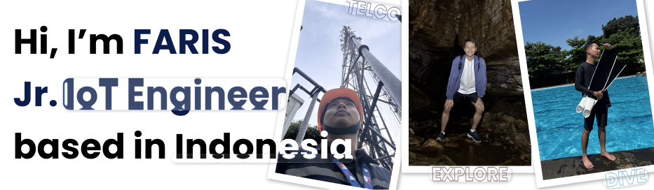

# Hi there👋, I'm Faris Rafi Pramana

Computer Engineering student who loves tinkering with electronics and 3D printing to make cool stuff and automate everyday tasks. I'm really into __Embedded Systems__ and __IoT__ development, and I'm always looking for new ways to use technology to simplify my life (and maybe yours too!).

# 🛠️ My Toolkit:
<!-- header without break line -->

  

  

